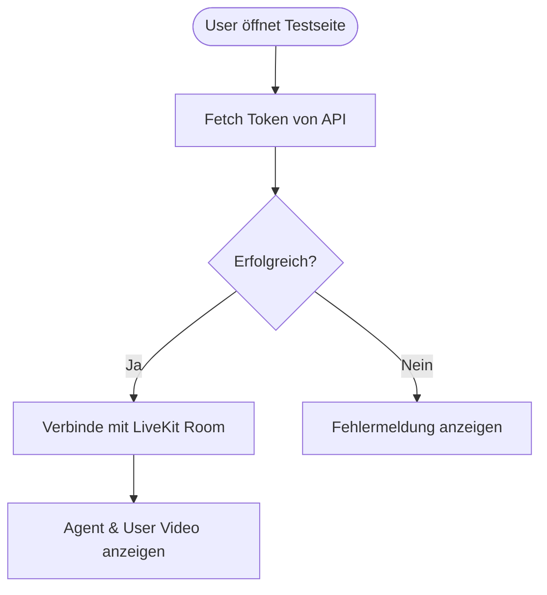

# Plan: Beyond Presence Live Video Agent Integration

Dieses Dokument beschreibt die Schritte zur Integration des Beyond Presence Live Video Agenten in die Testseite der Linkty-Hauptseite.

## Übersicht
Der Agent ist bereits in der LiveKit Cloud konfiguriert. Wir werden die LiveKit React Components nutzen, um eine direkte Verbindung zum Raum herzustellen, anstatt ein Iframe zu verwenden.

## Technische Details
- **Token-Endpunkt**: `https://livekit-test.erkens.cloud/api/token?room=paula-demo&name=testuser`
- **LiveKit URL**: `wss://linkty-webseite-lb5l5qct.livekit.cloud` (aus Token-Response extrahiert)
- **Framework**: React mit `@livekit/components-react`

## Umsetzungsschritte

### 1. Abhängigkeiten
Installation der benötigten Pakete:
```bash
npm install @livekit/components-react @livekit/components-styles livekit-client
```

### 2. Neue Komponente `BeyondPresenceAgent`
Erstellung einer Komponente, die den Verbindungsstatus verwaltet und das LiveKit-Interface anzeigt.

#### Features:
- Automatischer Fetch des Tokens beim Laden.
- Anzeige eines Ladezustands.
- Integration der `LiveKitRoom` Komponente.
- Nutzung von `VideoConference` für ein schnelles Setup.

### 3. Integration in `TestChatPage.tsx`
Ersetzen des aktuellen Iframes durch die neue `BeyondPresenceAgent` Komponente.

## Mermaid Diagramm (Workflow)



## Offene Fragen / Klärungen
- Soll der Agent in einem speziellen Layout (z.B. Vollbild) angezeigt werden?
- Wird ein Button zum Starten der Verbindung benötigt oder soll diese automatisch aufgebaut werden?
